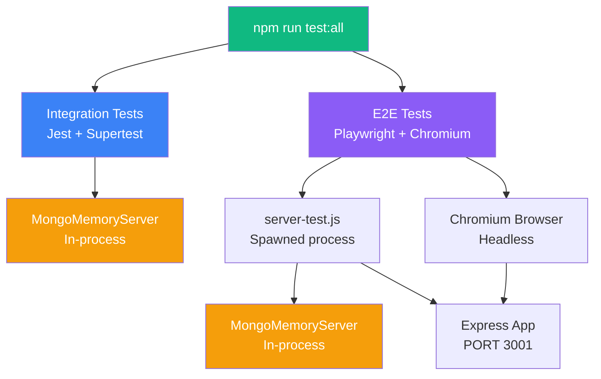

# Walkthrough — Automated Testing: Sistem Mutabaah Mahasiswa

## Ringkasan Hasil

| Kategori | Jumlah Test | Status | Durasi |
|---|---|---|---|
| Integration Tests (Jest) | 31 | ✅ ALL PASS | ~28s |
| E2E Tests (Playwright) | 54 | ✅ ALL PASS | ~1.1m |
| **TOTAL** | **85** | **✅ ALL PASS** | **~1.5m** |

**Backend Code Coverage: 71.37% statements** (target 70% ✅)

---

## Arsitektur Testing



> [!IMPORTANT]
> Semua test menggunakan **MongoMemoryServer** (database in-memory). **Database production MongoDB Atlas tidak pernah disentuh**.

---

## File yang Dibuat / Dimodifikasi

### Backend — Preparation

| File | Aksi | Keterangan |
|---|---|---|
| [rateLimiter.js](file:///e:/ProjectWebsite_Mutabaah-Mahasiswa/backend/src/middleware/rateLimiter.js) | ✏️ Modified | Bypass rate-limit saat `NODE_ENV=test` |
| [app.js](file:///e:/ProjectWebsite_Mutabaah-Mahasiswa/backend/src/app.js) | ✏️ Modified | Register `testHelper.routes.js` (guard test-only) |
| [.env.test](file:///e:/ProjectWebsite_Mutabaah-Mahasiswa/backend/.env.test) | ➕ New | Environment variables khusus test |
| [testHelper.routes.js](file:///e:/ProjectWebsite_Mutabaah-Mahasiswa/backend/src/routes/testHelper.routes.js) | ➕ New | Endpoints `/api/test/seed`, `/cleanup`, `/status`, `/seed-evaluation` |
| [server-test.js](file:///e:/ProjectWebsite_Mutabaah-Mahasiswa/backend/src/server-test.js) | ➕ New | Entry point server test (init MongoMemoryServer → Express) |

### Integration Tests (Jest + Supertest)

| File | Jumlah Tests |
|---|---|
| [auth.integration.test.js](file:///e:/ProjectWebsite_Mutabaah-Mahasiswa/backend/tests/integration/auth.integration.test.js) | 14 tests |
| [evaluasi.integration.test.js](file:///e:/ProjectWebsite_Mutabaah-Mahasiswa/backend/tests/integration/evaluasi.integration.test.js) | 5 tests |
| [evaluasi.extended.integration.test.js](file:///e:/ProjectWebsite_Mutabaah-Mahasiswa/backend/tests/integration/evaluasi.extended.integration.test.js) | 12 tests |

### E2E Tests (Playwright)

| File | Jumlah Tests | Cakupan |
|---|---|---|
| [auth.spec.js](file:///e:/ProjectWebsite_Mutabaah-Mahasiswa/e2e/auth.spec.js) | 10 | Login 3 role, login gagal 3 skenario, logout |
| [assessment.spec.js](file:///e:/ProjectWebsite_Mutabaah-Mahasiswa/e2e/assessment.spec.js) | 9 | Akses halaman, isi 9 dropdown, submit, validasi required, auto-fill |
| [dashboard.spec.js](file:///e:/ProjectWebsite_Mutabaah-Mahasiswa/e2e/dashboard.spec.js) | 15 | Dashboard mahasiswa (9), admin (6), pembina (3) |
| [role-access.spec.js](file:///e:/ProjectWebsite_Mutabaah-Mahasiswa/e2e/role-access.spec.js) | 17 | 8 halaman protected redirect, API 401/403/200, token invalid |

### E2E Helpers & Config

| File | Keterangan |
|---|---|
| [playwright.config.js](file:///e:/ProjectWebsite_Mutabaah-Mahasiswa/playwright.config.js) | Config: workers=1, chromium only, baseURL localhost:3001 |
| [global-setup.js](file:///e:/ProjectWebsite_Mutabaah-Mahasiswa/e2e/global-setup.js) | Spawn server-test.js, wait ready, seed data |
| [global-teardown.js](file:///e:/ProjectWebsite_Mutabaah-Mahasiswa/e2e/global-teardown.js) | Cleanup database, kill server process |
| [auth.helper.js](file:///e:/ProjectWebsite_Mutabaah-Mahasiswa/e2e/helpers/auth.helper.js) | `loginViaUI()`, `loginViaAPI()`, `logoutViaUI()`, `clearSession()` |
| [db.helper.js](file:///e:/ProjectWebsite_Mutabaah-Mahasiswa/e2e/helpers/db.helper.js) | `seedInitialData()`, `cleanupDatabase()`, `resetDatabase()` |

### Documentation

| File | Keterangan |
|---|---|
| [package.json](file:///e:/ProjectWebsite_Mutabaah-Mahasiswa/package.json) | Root-level npm scripts |
| [TESTING.md](file:///e:/ProjectWebsite_Mutabaah-Mahasiswa/TESTING.md) | Panduan lengkap menjalankan semua test |

---

## Cara Menjalankan

```powershell
# Integration tests saja (dengan coverage)
cd backend && npm test

# E2E tests saja
cd e:\ProjectWebsite_Mutabaah-Mahasiswa
npm run test:e2e

# Semua test sekaligus
npm run test:all

# E2E dengan browser tampil (bisa ditonton)
npm run test:e2e:headed

# Buka laporan HTML
npm run test:report
```

---

## Daftar Lengkap 54 E2E Test Cases

### auth.spec.js (10 tests)
1. ✅ mahasiswa berhasil login dengan NIM dan diarahkan ke dashboard mahasiswa
2. ✅ admin berhasil login dengan No HP dan diarahkan ke dashboard admin
3. ✅ pembina berhasil login dengan No HP dan diarahkan ke dashboard pembina
4. ✅ session tersimpan dengan benar di localStorage setelah login
5. ✅ menampilkan pesan error saat password salah
6. ✅ menampilkan pesan error saat NIM tidak terdaftar
7. ✅ menampilkan peringatan frontend saat field kosong
8. ✅ mahasiswa berhasil logout dan localStorage terhapus
9. ✅ admin berhasil logout dari dashboard admin
10. ✅ membatalkan logout tidak menghapus session

### assessment.spec.js (9 tests)
11. ✅ redirect ke login jika mengakses isimutabaah.html tanpa sesi
12. ✅ mahasiswa yang sudah login dapat mengakses halaman assessment
13. ✅ form menampilkan 9 dropdown amalan ibadah
14. ✅ mahasiswa berhasil mengisi semua field dan submit
15. ✅ tombol submit menampilkan teks "Mengirim..." saat proses berlangsung
16. ✅ form tidak bisa disubmit jika ada field yang belum dipilih
17. ✅ setiap dropdown memiliki atribut required
18. ✅ form auto-fill dengan data minggu berjalan yang sudah diisi sebelumnya
19. ✅ link batal kembali ke dashboard mahasiswa

### dashboard.spec.js (15 tests)
20. ✅ halaman dashboard mahasiswa berhasil dimuat
21. ✅ menampilkan nama user yang login di header welcome
22. ✅ menampilkan indikator minggu berjalan
23. ✅ menampilkan 2 menu card (Isi Mutabaah dan Monitoring)
24. ✅ navigasi: klik "Isi Sekarang" menuju halaman assessment
25. ✅ navigasi: klik "Rekapan" menuju halaman rekapan
26. ✅ navigasi: klik "Grafik" menuju halaman grafik
27. ✅ tombol logout tampil dan dapat diklik
28. ✅ modal FAQ muncul saat klik tombol bantuan (?)
29. ✅ halaman dashboard admin berhasil dimuat
30. ✅ menampilkan label "Admin Area" di header
31. ✅ menampilkan 2 menu card admin (Monitoring dan Statistik)
32. ✅ navigasi: klik "Buka Data Pantau" menuju adminpantau.html
33. ✅ navigasi: klik "Lihat Tren Kampus" menuju admintren.html
34. ✅ tombol logout tampil dan dapat diklik
35–37. ✅ Dashboard pembina: dimuat, label "Pembina Area", tombol logout

### role-access.spec.js (17 tests)
38–45. ✅ 8 halaman protected redirect ke `/` tanpa session
46. ✅ POST /api/evaluasi/webhook tanpa token → 401
47. ✅ GET /api/evaluasi/stats tanpa token → 401
48. ✅ GET /api/evaluasi/all-stats tanpa token → 401
49. ✅ mahasiswa mendapat 403 saat akses /api/evaluasi/all-stats
50. ✅ mahasiswa mendapat 403 via localStorage token
51. ✅ admin berhasil akses /api/evaluasi/all-stats → 200
52. ✅ pembina berhasil akses /api/evaluasi/all-stats → 200
53. ✅ token palsu ditolak dengan 401
54. ✅ token expired ditolak dengan 401

---

## Bug Fixes During Testing

1. **`clearSession` SecurityError** — Test yang hanya menggunakan `request` fixture (tanpa navigasi browser) gagal saat `afterEach` karena page masih di `about:blank`. Fix: try-catch + URL check di [auth.helper.js](file:///e:/ProjectWebsite_Mutabaah-Mahasiswa/e2e/helpers/auth.helper.js#L88-L96).

2. **Form validasi test gagal karena auto-fill** — Test sebelumnya submit evaluasi, lalu test validasi berikutnya memuat form yang auto-fill dari data sebelumnya. Fix: `resetDatabase()` di `afterEach` [assessment.spec.js](file:///e:/ProjectWebsite_Mutabaah-Mahasiswa/e2e/assessment.spec.js#L9-L12).

3. **MongoMemoryServer re-download binary** — Server test di-spawn sebagai proses terpisah sehingga cache binary tidak ditemukan. Fix: set `MONGOMS_DOWNLOAD_DIR` ke path cache yang sudah ada di [global-setup.js](file:///e:/ProjectWebsite_Mutabaah-Mahasiswa/e2e/global-setup.js#L54-L57).

4. **Pembina logout selector** — Dashboard pembina menggunakan `onclick="logout()"` tanpa class `logout-btn`. Fix: selector diubah di [dashboard.spec.js](file:///e:/ProjectWebsite_Mutabaah-Mahasiswa/e2e/dashboard.spec.js#L140).
